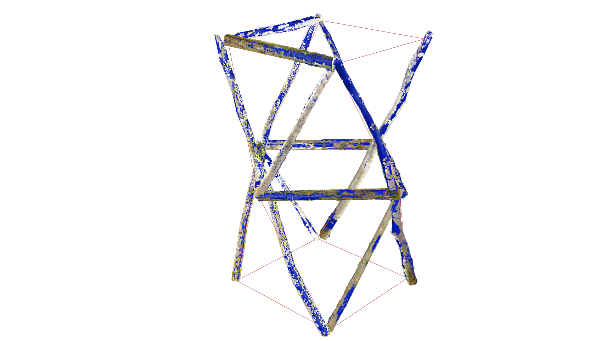
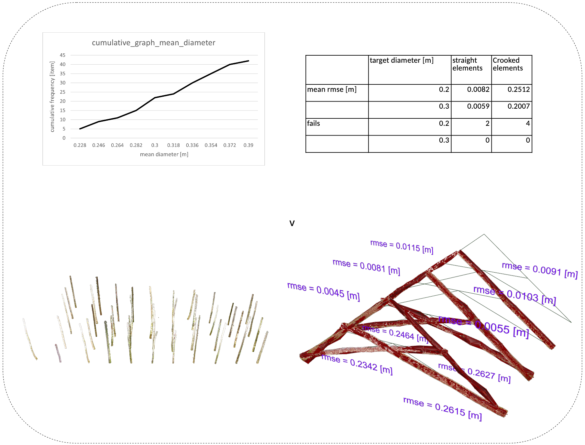

# Carnutes🌳

🪵 In Asterix & Obelix, the Carnutes forest is where druids present their latest crazy inventions to their peers 🪵

 

This repo contains the code produced as part of the studio Weinand, the architecture studio directed by Prof. Yves Weinand, and Assist. Dr. Agathe Mignon at IBOIS, EPFL (Switzerland), taught to 3rd bachelor and 1st master students.

This code is also a preparation to the research package 3 of Damien Gilliard's PhD thesis. This preparation work aims at finding out what the needs are in the context of roundwood architecture design, through the practice. By collaborating closely with the students through  a series of workshops, design needs will be identified, and the code will be improved and adapted accordingly.

Lastly, this repository is a quick python experiment, has been swiftly developed, and is not meant as a final product. It is made public for transparency purposes.

[! Warning:  This repo is under active development, but the main branch should work fine at any point]

## Goal

 This project must enable the students to:
- Dispose of a database of simple tree trunks geometries ✅
- Match the tree trunk geometries with an 3D sketch of an architectural design. ✅
- Generate architectural drawings with the tree trunk geometries. ❌

For this, the following functions are planned:

- Practical:
    - Allocate trees automatically and orient given cylinder model ❌
    - Allocate trees automatically and orient given wireframe model ✅
    - Allocate trees manually and orient given cylinder model ❌
    - Allocate trees manually and orient given wireframe model ✅
    - Create locally oriented bounding box of overlap to assist students to experiment with their own joinery ❌
    - reset the database to original state ✅

- Graphical:
    - Draw connectivity Graphs of 3D models ✅
    - Joint mapping (must be clarified)
    - Highlight difference between initial model and model with tree trunks (once the right tree trunks are selected):
        - using wireframe data ❌
        - using cylinder data ❌

    

    

# Install and use
This tool is intended to be used in Rhino 8.
See the [INSTALL.md](./INSTALL.md) for installation instructions, and the [CONTRIBUTING.md](./CONTRIBUTING.md) for minimal contribution guidelines. This repo contains a small .3dm to easily test Carnutes.
