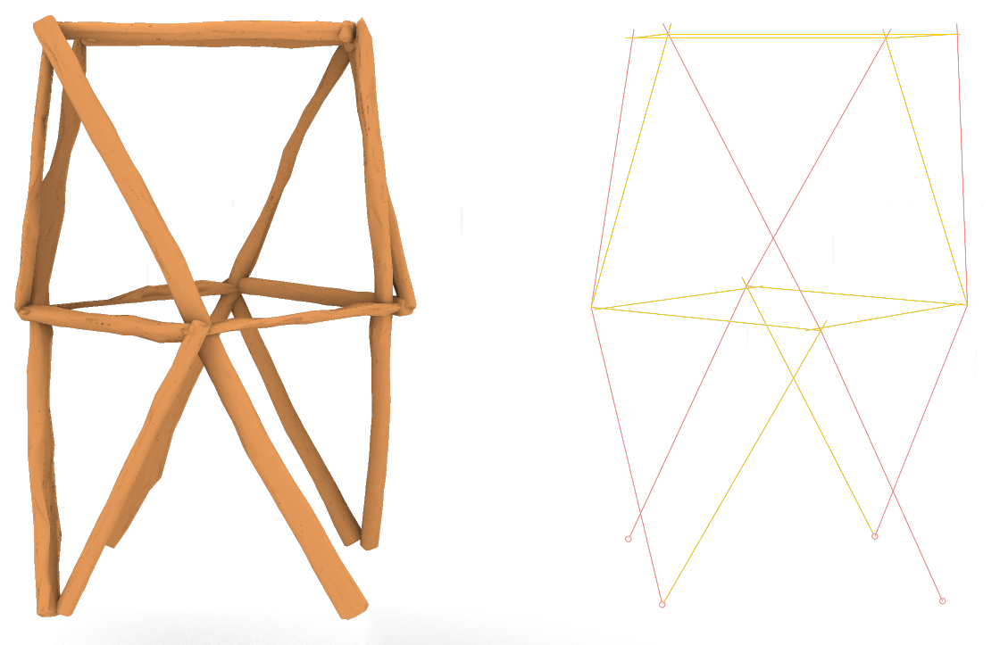
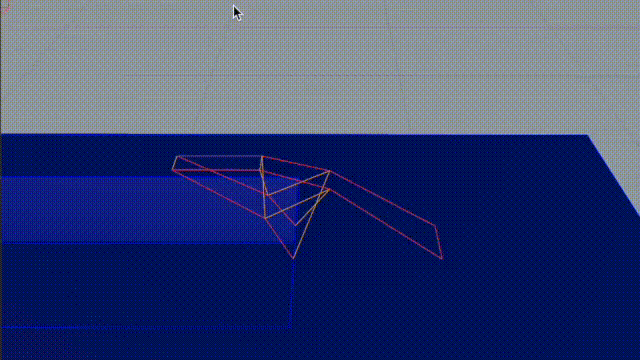

# Carnutes🌳

🪵 In Asterix & Obelix, the Carnutes forest is where druids present their latest crazy inventions to their peers 🪵

 

This repo contains the code produced as part of the Autumn 2024 studio ibois, the architecture studio directed by Prof. Yves Weinand, and Assist. Dr. Agathe Mignon at IBOIS, EPFL (Switzerland), taught to 3rd bachelor and 1st master students.

This code is also a preparation to the research package 3 of Damien Gilliard's PhD thesis. This preparation work aims at finding out what the needs are in the context of roundwood architecture design, through the practice. By collaborating closely with the students through a series of workshops, design needs will be identified, and the code will be improved and adapted accordingly.

Lastly, this repository is a quick python experiment, has been swiftly developed, and is not meant as a "final" product. It is made public for sharing purposes but is not destined to wide adoption.

## What is Carnutes ?

Carnutes is an ensemble of commands for Rhino 8 CAD software that make roundwood design easier.

This project enables the user to:
- Dispose of a database of simple tree trunks geometries.
- Match the tree trunk geometries with an 3D sketch of an architectural design.

Check out [this repo's wiki](./wiki) for the documentation of individual commands

    

# Install and use
This tool is intended to be used in Rhino 8.
See the [INSTALL.md](./INSTALL.md) for installation instructions, and the [CONTRIBUTING.md](./CONTRIBUTING.md) for minimal contribution guidelines. This repo contains a small .3dm to easily test Carnutes.
