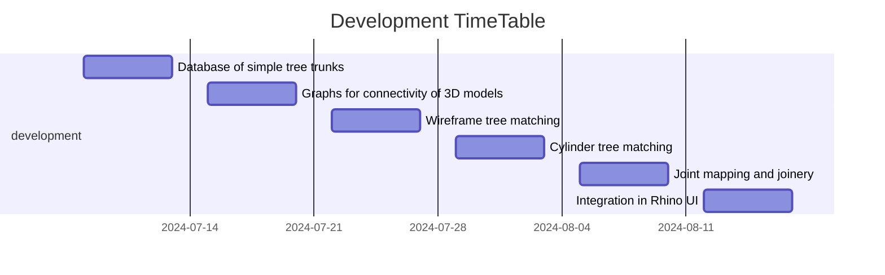

# Carnutes🌳

🪵 In Asterix & Obelix, the Carnutes forest is where druids present their latest crazy inventions to their peers 🪵

This repo contains the code produced as part of the studio Weinand, the architecture studio directed by Prof. Yves Weinand, and Assist. Dr. Agathe Mignon at IBOIS, EPFL (Switzerland), taught to 3rd bachelor and 1st master students.

This code is also a preparation to the research package 3 of Damien Gilliard's PhD thesis. This preparation work aims at finding out what the needs are in the context of roundwood architecture design, through the practice. By collaborating closely with the students through  a series of workshops, design needs will be identified, and the code will be improved and adapted accordingly.

Lastly, this repository is a quick python experiment, has been swiftly developed, and is not meant as a final product. It is made public for transparency purposes.

## Goal

 This project must enable the students to:
- Dispose of a database of simple tree trunks geometries
- Match the tree trunk geometries with an 3D sketch of an architectural design.
- Generate architectural drawings with the tree trunk geometries.

For this, the following functions are planned:

- Practical:
    - Select trees automatically and orient given cylinder model
    - Select trees automatically and orient given wireframe model
    - Select trees manually and orient given cylinder model
    - Select trees manually and orient given wireframe model
    - Create locally oriented bounding box of overlap to assist students to experiment with their own joinery

- Graphical:
    - Draw connectivity Graphs of 3D models
    - Joint mapping (must be clarified)
    - Highlight difference between initial model and model with tree trunks (once the right tree trunks are selected):
        - using wireframe data (must be clarified)
        - using cylinder data

# Install and use
This tool is intended to be used in Rhino 8.
See the [INSTALL.md](./INSTALL.md) for installation instructions, and the [CONTRIBUTING.md](./CONTRIBUTING.md) for minimal contribution guidelines

# 4 workshops will be held within the Studio:

template schedule:
9h - 9h30: welcome and a few slides to present the material for the workshop
9h30-10h30: guided exercice with the students, individual feed-back
10h30-10h45: wrap-up and expectations for next workshop

### 🌲S1: digitalisation of the real world 
(LiDAR, photogrammetry, ...) a little bit of theory.

-> The students can scan a tree and gain knowledge on how we can transfer the real world into the digital world.

-> Deliverable: a point cloud gathered with the students

### 🌲S2: Intro to the rhino functions
Manipulate tree trunk geometries: introduction to the tools offered, first anticipatory feed-back of students. Improved code (within time constrains) given to students for the next workshop.

-> The students learn to manipulate tree trunk geometries easily: translation and rotation. To start with, a simple 3D sketch is provided to the students. The students learn the basics of the proposed tools. They get out of this workshop with the ability to manipulate tree trunk geometries and to represent them graphically.

-> deliverable: a simple example of an architectural structure that the students have converted from 3D sketch to actual roundwood model.

### 🌲S3: / 
NO DIGITAL WORKSHOP, but the students come up with their own 3D sketches model of what their design could look like. How do the small pieces fit together? What are the material constraints? What are the geometrical possibilities? How do the pieces join together ? Some or all these question are addressed by the students.

### 🌲S4: Presentation, feed-back and improvement. 
Small presentation of each student (1 screen shot of the work done) of the geometries and joinery, on which feed-back is given. Improvement of the tools are asked to Damien. Improved code (within time constrains) given to students for the next workshop. Concerning the improvements, some choices might be necessary.

Presentation of the graphical representation tools, and emphasis on joinery.

-> The students learn to critically analyse their needs and formulate the need for improvement. They also learn new graphical representation tools and roundwood joinery techniques

-> deliverable: one nice drawing from each student using the introduced functions, and individual feed-back on the structure the students developed.

### 🌲S5: Presentation, feed-back and improvement.
Small presentation of each student (1 screen shot of the work done) of the geometries and joinery, on which feed-back is given. Improvement of the tools are asked to Damien. Improved code (within time constrains) given to students for the next week.

-> The students present the new applications / adaptations of the tool.

-> deliverable: a complete 3d model of their individual feed-back on the structure the students developed.
## Development timetable

